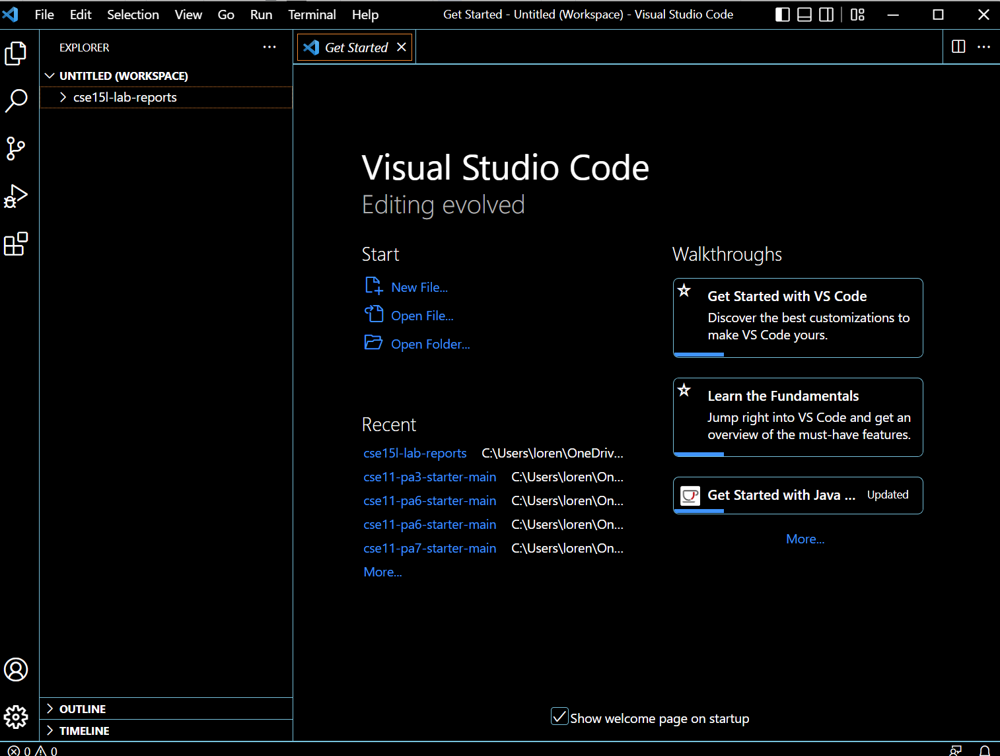
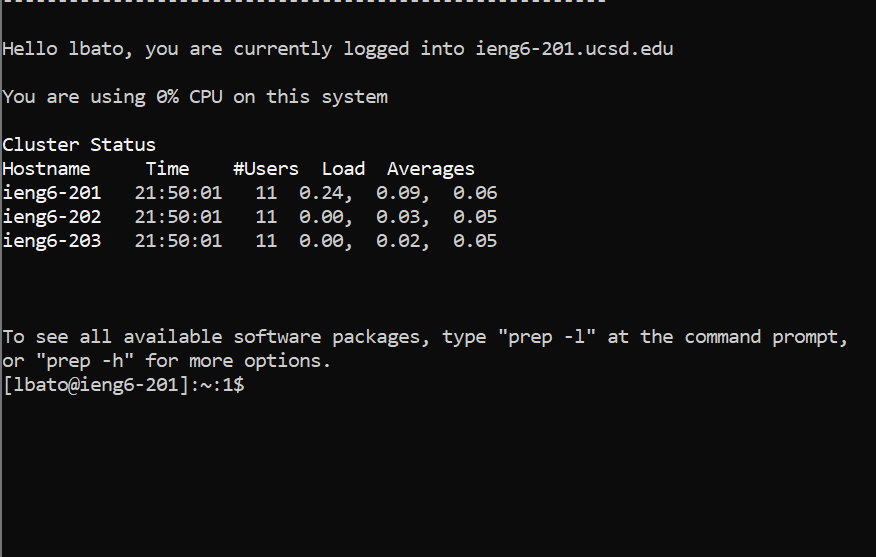
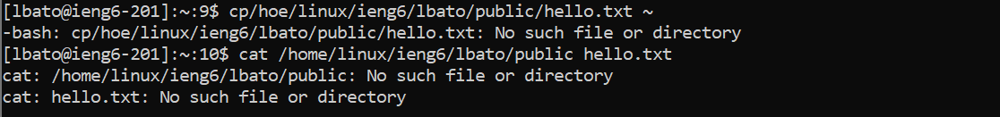
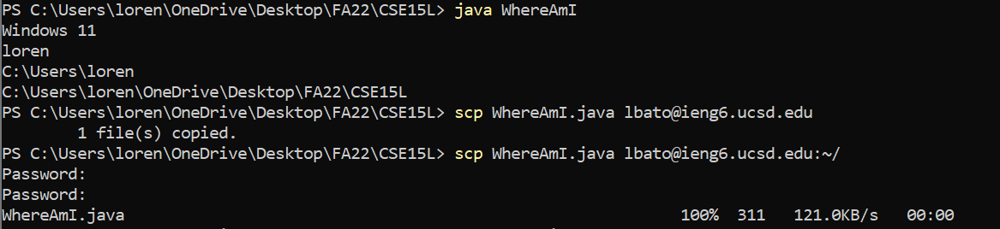
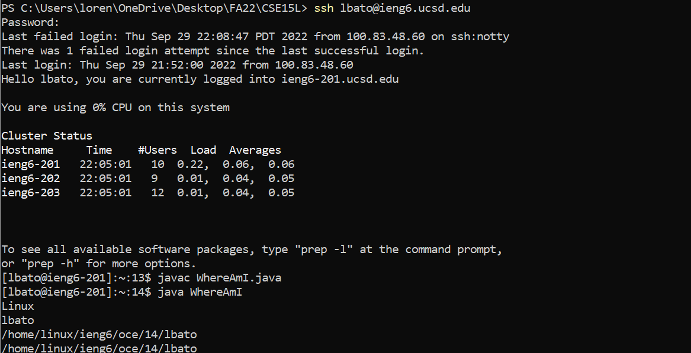
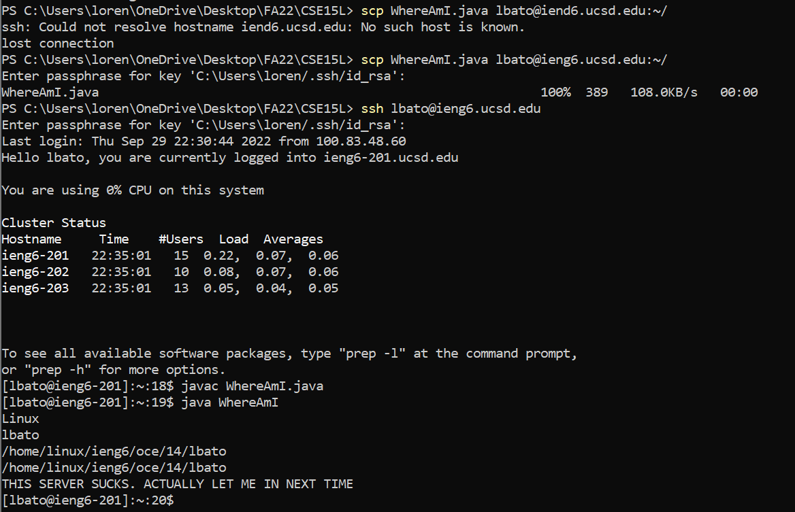

# **There's Always a Bigger Pond: Remote Connection through .ssh Tutorial**
## By: Lorenzo "Enzo" Bato
> *The folllowing method comes with prerquisite downloads and operates on the following assumption.* 
>* *there exists an account*
>* *user has access to said account*
#
## *Pre-requisites* (not detailed in this tutorial)
* OpenSSH (client download, **NOT** server)
#
## **Installing VSC**
Download Visual Studio Code through the following link: [Visual Studio Code](https://code.visualstudio.com/ "VSC Download")

>*Note: Verify that the install corresponds to the OS on the computer you are working on.*

If done correctly, opening the app should look like this upon opening the first time:


#
## **Connecting Remotely**
> *The following steps can be done by opening a terminal in VSCode or running Windows Powershell as an administrator on the current PC. This method chose to run it through Windows Powershell.*

Type in the following into the terminal (every **$** is not meant to be typed in. It signifies the line being typed in) and hit enter:

`$ ssh cs15lqtyyxx@ieng6.ucsd.edu`
>*The **qtyyxx** are meant to be specific to each student according to the account assigned to their UCSD Active Directory. Refer to this [link](https://sdacs.ucsd.edu/~icc/index.php "Acc. Lookup") to find the two letters associated to your account.*

After hitting enter, you will be prompted for a password that corresponds to your UCSD AD. Enter it in and it should show a screen similar to this:
 

>**[!!!]** *Many students (this user included) had difficulty using their `cs15lqtyyxx` account. Reseting the password to all can (but not always) resolve this issue. Using your UCSD AD username will allow you to complete this under your username, but it is recommended to reach out to TAs/attend office hours/visit the IT desk in order to diagnose the issue*

#
## **Trying Commands**
Once in, you can try different commands like `cd`, `cat`, `ls`, and `pwd` to experiment with the returns.

For the following investigation we used the `cat` file in order to prove the absence of the `WhereAmI.java` file within our directory.

It should look something like this:


#
## **Finding (or creating) WhereAmI.java**
WhereAmI.java actually doesn't exist (yet). In VSCode, open a new Java file and copy and paste the following:

```
$ class WhereAmI { 
$   public static void main(String[] args) {
$     System.out.println(System.getProperty("os.name"));
$     System.out.println(System.getProperty("user.name"));
$     System.out.println(System.getProperty("user.home"));
$     System.out.println(System.getProperty("user.dir"));
$   }
$ }
```

> *This file, when ran, gets proprties of the system like `os.name` and `user.dir` and prints them out of the terminal.*

After creating that file and saving it, in the terminal you are using, type the following and enter:
```
$ javac WhereAmI.java
$ java WhereAmI
```

> * `javac` *compiles* the file after it
> * `java` *runs* the file after it

#
## **Finding (or copying over) WhereAmI.java**
Sign out of the remote account using `exit` or Ctrl+D. Now that you are on your local machine, type in the following:

`$ scp WhereAmI.java cs15lqtyyxx@ieng6.ucsd.edu:~/`

Where AmI.java was copied over to the home directory of your remote account. The process should look like this:

> *Note: the download on the bottom left should show a live download counter with the percentage, size, speed, and duration listed accordingly*

Signining back in, compiling, and running the file should show different results according to the server, rather than the local system we have seen previously (shown above in the image).

#
## **KeyGen: Machine "FastPass"**
As you might be aware, it was difficult signing back in and out (especially with the way the passwords work). With that being said, there is a way to expedite the process by using the `ssh-keygen` command. This command creates a public and private key, which can be used instead of passwords.

Enter the command on your terminal and then hit enter twice to save the "key", which will automatically save it to the default location, and to enter an empty passphrase (don't worry, not exactly unsecure)

> **[&]** *We want an empty passphrase because the purpose is to NOT have to type in a password everytime we sign in. We can just hit enter again to sign in quickly*

Doing this method will save the keys in the `.ssh` file of your computer as `id_rsa` and `id_rsa.pub` respectively. We now want to use the method in **Finding WhereAmI.java** to copy over the keys to the surver in order to use them.

Sign into the server, type `$ mkdr .ssh`, then log out.
Then, on the local machine, type in:
```
$ scp /Users/<yourlocaluser>/.ssh/id_rsa.pub cs15lqtyyxx@ieng6.ucsd.edu:~/.ssh/authorized_keys
```
> *The `<yourlocaluser>` is dependent on your local machine. See the path where the keys were saved and use that path specifically.*

Doing so, you can now sign in, run WhereAmI.java, and it will yeild somethign similar to this:


#
## **Optimizing KeyGen**
Did you really set up your "FastPass" correctly? Try this:
1. Edit WhereAmI.java locally.
2. Copy from your local machine to your remote account.
3. Sign back in to your remote account
4. Run the new WhereAmI.java on your remote account.

> *Note: The machine replaces files with the same name. Doing this message essentially "updates" WhereAmI.java, but in actuality replaces the file. Be careful when copying files and file names!*

Did you find the process expidited? Refer back to the note detailed in **[&]**. The user did not do this, which is why his task took significantly longer than the others. The file also contained edits that were not a single character (in fact, it contained a **personal** message to the server). To expedite the process and check how much time this saves (with no variable), compare sign in times while keeping these variables in check:
* minimal edits
* empty passphrase

Ensuring these variables are kept in check, your process is optimized. The edits are dependent on what your are updating but the empty passphrase is **ESSENTIAL** to expedited work.

Seen here is the (significantly longer) Edit-SignIn speedrun done by this particular user:

