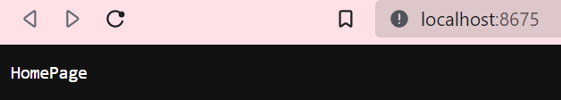
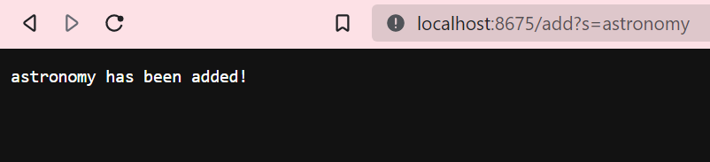
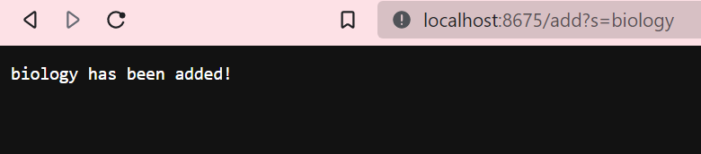
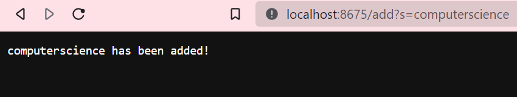
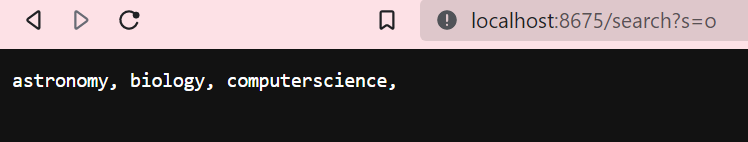
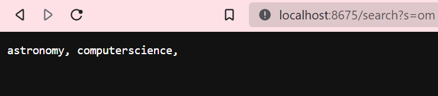

# **Week 3 Lab Report**
## By: Lorenzo Bato
## ***Part 1: Simple Search Engine***
*The following code was used as a simple search engine to process String queries:* 
```
import java.io.IOException;
import java.net.URI;
import java.util.ArrayList;
import java.util.List;

class SearchEngine{
    public static void main(String[] args) throws IOException {
        if(args.length == 0){
            System.out.println("Missing port number! Try any number between 1024 to 49151");
            return;
        }

        int port = Integer.parseInt(args[0]);

        Server.start(port, new Handler());
    }
}

class Handler implements URLHandler {
    String str;
    List<String> strs = new ArrayList<String>();
    
    @Override
    public String handleRequest(URI url) { //(2. )
        if (url.getPath().contains("/add")) {
            String[] parameters = url.getQuery().split("=");
            this.str = parameters[1];
            this.strs.add(this.str);
            if (parameters[0].equals("s")) {
                return this.str + " has been added!";
            }
            return "404 Not Found";
        } 
        else {
            System.out.println("Path: " + url.getPath());
            if (url.getPath().contains("/search")) {
                String[] parameters = url.getQuery().split("=");
                if (parameters[0].equals("s")) {
                    this.str = parameters[1];
                    List<String> goodStrs = new ArrayList<String>();
                    for(String s: this.strs) {
                        if(s.indexOf(this.str) != -1) {
                            goodStrs.add(s);
                        } 
                    }
                    String result = "";
                    for(int i = 0; i < goodStrs.size(); i++) {
                        result += goodStrs.get(i) + ", ";
                    }
                    return result;
                }
                return "/search not successful";
            }
            return "HomePage";
        }
    }
}
```
## Terminal Set-Up:
```
javac SearchEngine.java
javac SearchEngine nnnn
```
*Note: nnnn is a viable port number*

## Landing Page:

The following shows an image of the landing page after running `SearchEngine`. This is just meant to be a default page when it first runs.

## `/add?s=`... and Its Functions
Our first function takes the form of `/add?s=`. The argument after the `=` is a String that gets added into an ArrayList, which stores all the Strings that were added to the server.



*Adding the String "astronomy"*



*Adding the String "biology"*



*Adding the String "computerscience"*

*Note: all Strings are stored simultanously in the server in an ArrayList. The Strings aren't being replaced within the ArrayList*

## `/search?s=`... and Its Functions
Our next functions takes the form of `/search?s=`. The argument after the `=` takes in a String. That String will then be compared to all Strings that were added to the server. If any of those Strings contain the argument, they will be added to another ArrayList and returned at the end by the system. The Strings that did not contain the argument within it, it will be omitted from the return.




*Searching for Strings containing "o"*



*Searching for Strings containing "om"*

*Note: In the second image, "biology" does not contain "om", which is why the return is empty. However, it is still stored within the server.*

## ***Part 2: JUnit bugtesting***
**reversed()**
```
static int[] reversed(int[] arr) {
    int[] newArray = new int[arr.length];
    for(int i = 0; i < arr.length; i += 1) {
      arr[i] = newArray[arr.length - i - 1];
    }
    return arr;
}
```
The following code is found within `ArrayExamples.java`. This is the `reversed()` method within. However, it is **flawed**.

JUnit Test: 
```
public void testReversedWithNums() {
    int[] input1 = {3, 2, 1};
    assertArrayEquals(new int[]{1, 2, 3}, ArrayExamples.reversed(input1));
}
```
Failure: Excpected {[1]} but was {[0]}

This implmentation wrongfully sets and returns the wrong array. Instead, we are setting the old array as the new (empty) array, then returning the old array that is now empty. Flip the line in the for loop array so that it says `newArray[arr.length - i - 1] = arr[i];`. And then, return the correct array: `newArray`. The fixed version would look like this:
```
static int[] reversed(int[] arr) {
    int[] newArray = new int[arr.length];
    for(int i = 0; i < arr.length; i += 1) {
      newArray[arr.length - i - 1] = arr[i];
    }
    return newArray;
}
```

**filter()**

(ListExamples implements StringChecker interface)
```
ArrayList<String> strGood;

  public ListExamples(ArrayList<String> s) {
    this.strGood = s;
  }

  // Returns a new list that has all the elements of the input list for which
  // the StringChecker returns true, and not the elements that return false, in
  // the same order they appeared in the input list;
  static List<String> filter(List<String> list, StringChecker sc) {
    List<String> result = new ArrayList<>();
    for(String s: list) {
      if(sc.checkString(s)) {
        result.add(0, s);
      }
    }
    return result;
  }
...
  @Override
  public boolean checkString(String s) {
    if(this.strGood.indexOf(s) != -1) return true;
    else return false;
  }
```
The following method is found within the `ListExamples`. In this implementation, for the sake of convenience, the `ListExamples` class implements `StringChecker` interface and implements its metho at the end. It is supposed to filter words that return true for the StringChecker into a new array and return that array. Essentially, only words that pass the `StringChecker`'s `checkString()` method are returned at the end. They are also meant to appear in the same order that they appeared.


JUnit Test:
```
@Test
    public void testFilter() {
        List<String> list = new ArrayList<String>();
        List<String> expected = new ArrayList<String>();

        ArrayList<String> correctWords = new ArrayList<String>();
        correctWords.add("good");
        correctWords.add("still good");
        ListExamples sc = new ListExamples(correctWords);
        list.clear();
        expected.clear();

        list.add("");
        list.add("bad");
        list.add("good");
        list.add("good");
        list.add("still good");
        expected.add("good");
        expected.add("good");
        expected.add("still good");

        assertEquals(expected, ListExamples.filter(list, sc));
    }
```
Failure: expected:[[good, good, still good]] but was:[[still good, good, good]]

The code above is bugged because the ArrayList returned in reverse. The reason for that was because the `add()` method within the array, used the `add(int index, String string)` method, which adds the element to the 0th index and pushes the (what should have been first) element before it down one index.

The following code uses the `add(String string)` method on the String ArrayList, which adds the elements at the end of the ArrayList. When printing out, they come out in the order that they came in.
```
static List<String> filter(List<String> list, StringChecker sc) {
    List<String> result = new ArrayList<>();
    for(String s: list) {
      if(sc.checkString(s)) {
        result.add(s);
      }
    }
    return result;
}
```