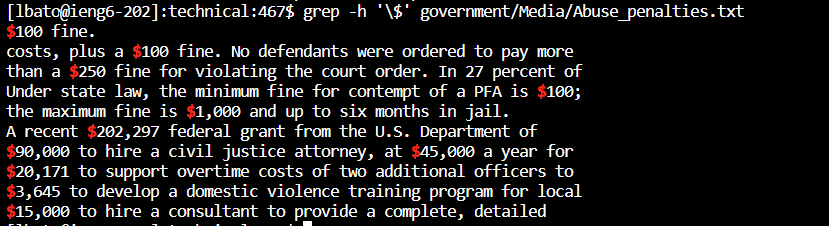
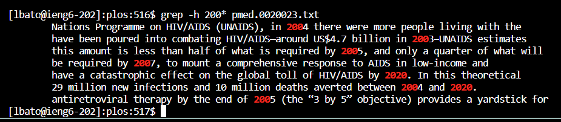

# **Week 5 Lab Report** #
## By: Lorenzo Bato ##
*This report aims to documment interesting command-line options for the* `grep` *command This is all within a directory in an SSH account called* `skill-demo1/technical`.

## `-c`
*Syntax:*
```
grep -c "<<string>>" <<path>>
```
## Example 1
*Input:*
```
$ grep -c "TSA" 911report/*.txt
```
*Output:*
```
911report/chapter-1.txt:0
911report/chapter-10.txt:0
911report/chapter-11.txt:0
911report/chapter-12.txt:17
911report/chapter-13.1.txt:0
911report/chapter-13.2.txt:6
911report/chapter-13.3.txt:0
911report/chapter-13.4.txt:0
911report/chapter-13.5.txt:1
911report/chapter-2.txt:0
911report/chapter-3.txt:0
911report/chapter-5.txt:0
911report/chapter-6.txt:0
911report/chapter-7.txt:0
911report/chapter-8.txt:0
911report/chapter-9.txt:0
911report/preface.txt:0
```
In this example of `-c`, I used the string "TSA" in order to find the chapter where they specifically talk about the effects of 911 on national security. This command can be useful when isolating what specific topic is talked about in what specific text.
## Example 2
*Input:*
```
$ grep -c "Al Qaeda" 911report/chapter-13.4.txt
```
*Output:*
```
14
```
In this example, we isolate the `.txt` file we are searching in, which allows us to show the frequency of certain strings in the file. This command helps with quantifying information within a larger text
## Example 3
*Input:*
```
$ grep -c "Osama" 911report/*.txt
```
*Output:*
```
911report/chapter-1.txt:0
911report/chapter-10.txt:0
911report/chapter-11.txt:0
911report/chapter-12.txt:0
911report/chapter-13.1.txt:0
911report/chapter-13.2.txt:0
911report/chapter-13.3.txt:2
911report/chapter-13.4.txt:5
911report/chapter-13.5.txt:0
911report/chapter-2.txt:0
911report/chapter-3.txt:0
911report/chapter-5.txt:0
911report/chapter-6.txt:0
911report/chapter-7.txt:2
911report/chapter-8.txt:0
911report/chapter-9.txt:0
911report/preface.txt:0
```
In this example, I wanted to find references to a certain person. This command can be useful when looking to reference, cite, or otherwise recall pieces of information in larger texts

## `-h`
*Syntax:*
```
grep -h "<<string>>" <<path>>
```
## Example 1
*Input:*
```
grep -h "9/11" 911report/preface.txt
```
*Output:*

In this example, the command actually printed out the lines from within the text and highlights them. This is useful visually, as the highlight helps with specifying where the specific keyword is.
## Example 2
*Input:*
```
grep -h '\$' government/Media/Abuse_penalties.txt
```
*Output:*

For this example, we used a trick to find monetary values. The keyword is input differently because "$" (dollar sign) is actually a special character. To denote that we want to actually search for a dollar sign, we use `'\$'` to specify that. This command is also prints out the line of the highlight, so we can discern whether we want to look for fines, grants, cost, etc. from using the provided context
## Example 3
*Input:*
```
 grep -h 200* plos/pmed.0020023.txt
```
*Output:*

This command, in combination with the properties of `*`, was used to find statistics and their years. It can be useful when highlighting patterns we are searching for when we traditionally use `grep`, and its nature allows that information to be contextualized.

## `-l`
*Syntax:*
```
$ grep -l "<<string>>" <<path>>
```
## Example 1
*Input:*
```
$ grep -l "Al Qaeda" 911report/*.txt
```
*Output:*
```
911report/chapter-1.txt
911report/chapter-10.txt
911report/chapter-11.txt
911report/chapter-12.txt
911report/chapter-13.3.txt
911report/chapter-13.4.txt
911report/chapter-13.5.txt
911report/chapter-2.txt
911report/chapter-5.txt
911report/chapter-6.txt
911report/chapter-7.txt
911report/chapter-8.txt
```
In this example, we print out ever `.txt` file in `911report` that contains that string. This differs from `-c` as `-c` will still print out those with 0 instances of the string. `-l` seems useful for when dealing with paths, as the listed paths can then be used in succeeding commands.
## Example 2
*Input:*
```
 grep -l "" government/*/*
```
*Output:*
```
government/Media/5_Legal_Groups.txt
government/Media/AP_LawSchoolDebts.txt
government/Media/A_Perk_of_Age.txt
government/Media/A_helping_hand.txt
government/Media/Abuse_penalties.txt
government/Media/Advocate_for_Poor.txt
government/Media/Aid_Gets_7_Million.txt
government/Media/All_May_Have_Justice.txt
government/Media/Annual_Fee.txt
government/Media/Anthem_Payout.txt
government/Media/Assuring_Underprivileged.txt
government/Media/Attorney_gives_his_time.txt
government/Media/Avoids_Budget_Cut.txt
government/Media/Barnes_Volunteers.txt
government/Media/Barnes_new_job.txt
government/Media/Barnes_pro_bono.txt
government/Media/Barr_sharpening_ax.txt
government/Media/BergenCountyRecord.txt
government/Media/Bias_on_the_Job.txt
government/Media/Boone_legal_service.txt
government/Media/Bridging_legal_aid_gap.txt
government/Media/BusinessWire.txt
government/Media/BusinessWire2.txt
government/Media/Butler_Co_attorneys.txt
government/Media/Campaign_Pays.txt
government/Media/City_Council_Budget.txt
government/Media/Civil_Matters.txt
government/Media/CommercialAppealMemphis2.txt
government/Media/Commercial_Appeal.txt
government/Media/Coup_Reshapes_Legal_Aid.txt
government/Media/Court_Keeps_Judge_From.txt
government/Media/Crains_New_York_Business.txt
government/Media/Disaster_center.txt
government/Media/Do-it-yourself_divorce.txt
government/Media/Domestic_Violence_Ruling.txt
government/Media/Domestic_violence_aid.txt
government/Media/Donald_Hilliker.txt
government/Media/Entities_Merge.txt
government/Media/Eviction_law.txt
government/Media/FY_04_Budget_Outlook.txt
government/Media/Farm_workers.txt
government/Media/Federal_agency.txt
government/Media/Few_who_need.txt
government/Media/Fire_Victims_Sue.txt
government/Media/Firm_to_the_Poor_Needs_Help.txt
government/Media/FortWorthStarTelegram.txt
government/Media/Free_Legal_Assistance.txt
government/Media/Free_legal_service.txt
government/Media/Funding_May_Limit.txt
government/Media/Funding_cuts_force.txt
government/Media/Funds_Shortage.txt
government/Media/Ginny_Kilgore.txt
government/Media/Good_guys_reward.txt
government/Media/Greedy_Generous.txt
government/Media/GreensburgDailyNews.txt
government/Media/Hard_to_Get.txt
government/Media/Helping_Hands.txt
government/Media/Helping_Out.txt
government/Media/Higher_Registration_Fees.txt
government/Media/Higher_court.txt
government/Media/IOLTA_INTEREST_RATE.txt
government/Media/It_Pays_to_Know.txt
government/Media/Justice_for_all.txt
government/Media/Justice_requests.txt
government/Media/Kiosks_for_court_forms.txt
government/Media/Law-school_grads.txt
government/Media/Law_Award_from_College.txt
government/Media/Law_Schools.txt
government/Media/Lawyer_Web_Survey.txt
government/Media/Legal-aid_chief.txt
government/Media/Legal_Aid_Society.txt
government/Media/Legal_Aid_attorney.txt
government/Media/Legal_Aid_campaign.txt
government/Media/Legal_Aid_in_Clay_County.txt
government/Media/Legal_Aid_looks_to_legislators.txt
government/Media/Legal_hotline.txt
government/Media/Legal_services_for_poor.txt
government/Media/Legal_system_fails_poor.txt
government/Media/Library_Lawyers.txt
government/Media/Lindsays_legacy.txt
government/Media/Local_Attorneys.txt
government/Media/Lockyer_Warns.txt
government/Media/Low-income_children.txt
government/Media/Major_Changes.txt
government/Media/Making_a_case.txt
government/Media/Marylands_Legal_Aid.txt
government/Media/NJ_Legal_Services.txt
government/Media/New_Online_Resources.txt
government/Media/New_funding_sources.txt
government/Media/Nonprofit_Buys.txt
government/Media/Oregon_Poor.txt
government/Media/Owning_a_Piece.txt
government/Media/Paralegal_Honored.txt
government/Media/Philly_Lawyers.txt
government/Media/Politician_Practices.txt
government/Media/Poor_Lacking_Legal_Aid.txt
government/Media/Poverty_Lawyers.txt
government/Media/Pro-bono_road_show.txt
government/Media/Pro_Bono_Services.txt
government/Media/Program_Lodges.txt
government/Media/Providing_Legal_Aid.txt
government/Media/Raising_the_Bar.txt
government/Media/Rental_rules.txt
government/Media/Retirement_Has_Its_Appeal.txt
government/Media/RoanokeTimes.txt
government/Media/Rumble_in_the_Bronx.txt
government/Media/Self-Help_Website.txt
government/Media/Service_Agency.txt
government/Media/State_funding.txt
government/Media/Supporting_Legal_Center.txt
government/Media/Survey.txt
government/Media/Targeting_Domestic_Violence.txt
government/Media/Terrorist_Attack.txt
government/Media/Texas_Lawyer.txt
government/Media/Texas_Supreme_Court.txt
government/Media/The_Bend_Bulletin.txt
government/Media/The_Columbian.txt
government/Media/The_State_of_Pro_Bono.txt
government/Media/Too_Crucial_to_Take_Cut.txt
government/Media/Towson_Attorney.txt
government/Media/Understanding.txt
government/Media/Unusual_Woodburn.txt
government/Media/Using_Tech_Tools.txt
government/Media/Valley_Needing_Legal_Services.txt
government/Media/Volunteers_Step_Up.txt
government/Media/Weak_economy.txt
government/Media/Wilmington_lawyer.txt
government/Media/Wingates_winds.txt
government/Media/Workers_aid_center.txt
government/Media/Working_for_Free.txt
government/Media/agency_expands.txt
government/Media/balance_scales_of_justice.txt
government/Media/defend_yourself.txt
government/Media/families_saved.txt
government/Media/fight_domestic_abuse.txt
government/Media/grants_fail_to_come.txt
government/Media/help_rent-to-own_tenants.txt
government/Media/highlight_Senior_Day.txt
government/Media/less_legal_aid.txt
government/Media/man_on_national_team.txt
government/Media/not_accessible_to_disabled.txt
government/Media/predatory_loans.txt
government/Media/pro_bono_efforts.txt
government/Media/residents_sue_city.txt
government/Media/water_fees.txt
```
This example allowed us to print all the files within `government/media`. For all of this lab report, we had been using grep commands to decipher `.txt` files. However, grep can also be used to list the files in directories, for whatever extension they may have.

In this example, our goal was to look for all instances of where "FBI" was mentioned. This is useful for narrowing down what `.txt` files were relevent to the keyword given.
## Example 3
*Input:*
```
grep -l "product manufacturing" plos/pmed*.txt
```
*Output:*
```
pmed.0020035.txt
```
In this example, we wanted to find a mention of "product manufacturing", but only within the file with the pretext of `pmed`. This command, in tandem with `*`, allows us to isolate files with instances of our keyword, but also control where we are searching, so that it does not just print out irrelevent files that also contain that keyword.