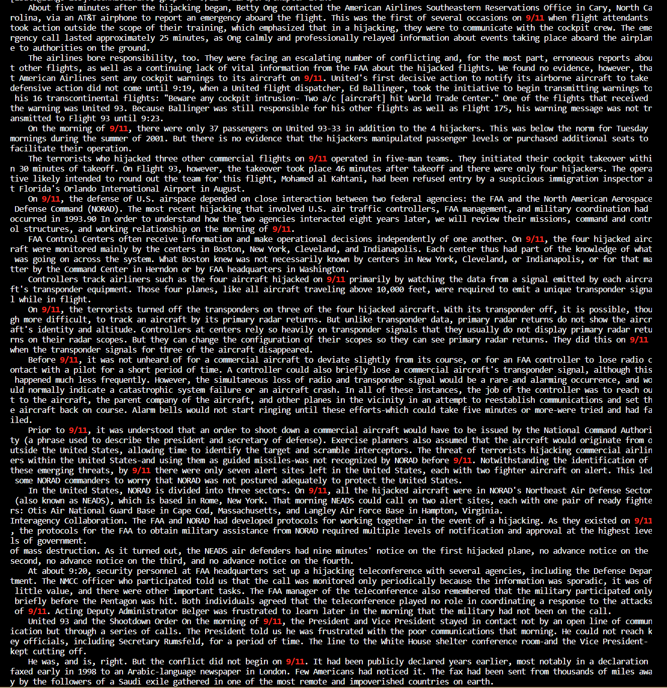
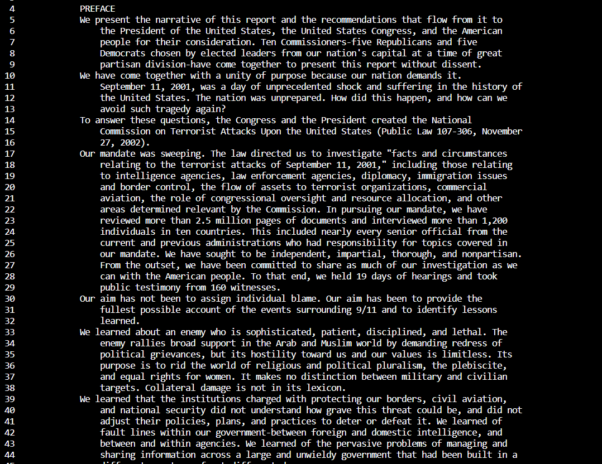

# **Week 5 Lab Report** #
## By: Lorenzo Bato ##
*This report will document 3 commands and their command-line options. This is all within a directory in an SSH account called* `skill-demo1/technical`

# Commands #
## ***find*** ##
```
find <<path>>
```
`find` *uses the* `<<path>>` *and finds files within the path as well as files in subdirectories within the path.*

## *Syntax* ##
```
find -name <<path>>
```
## *Input* ##
**Within skill-demo1/technical* *
```
find -name biomed
```
## *Output* ##
```
$ find -name biomed
./biomed
```
This usage of the `-name` option in find is useful, as it allows the user the ability to find any file that they can match the expression to in their directory. When applied to larger project or on a bigger scale, the `find -name` almost becomes essential.


## *Syntax* ##
```
find -empty <<path>>
```
## *Input* ##
```
$ find 911report -empty; find biomed -empty; find government -empty; find plos -empty
```
## *Output* ##
```
$ find 911report -empty; find biomed -empty; find government -empty; find plos -empty
$
```
*To clarify, our output returned empty, so there were no empty files and directories in our current directory (skill-demo1/technical).*

`-empty` is useful when locating empty files that may have came to be due to editing, file transfering, rewriting errors, etc. which can help coders in the debugging/coding process.

## *Syntax* ##
```
find -newer <<path>>
```
## *Input* ##
```
$ find -newer plos/pmed.0020274.txt
```
## *Output* ##
```
$ find -newer plos/pmed.0020274.txt
./plos
./plos/pmed.0020275.txt
./plos/pmed.0020278.txt
./plos/pmed.0020281.txt
```
`-newer` found all the files and directories that were edited/made after the given file. Our file was `pmed.0020274.txt` within the `plos` directory, which means that all the files printed were changed after adding the given files. It is also good to note that the director itself also changed because the actual files printed below were likely added/made after the given file's existence, so technically `plos` was changed. This command is useful when backtracking and finding which files were made after a certain point in time, as they can help debug which files are problematic after a certain update, highlight the files that are apart of the update, etc.

## ***grep*** ##
```
grep "<<string>>" <<path>>
```
`grep` *uses the* `"<<string>>"` *to find all files matching said argument within the given* `<<path>>`. 
## *Syntax* ##
```
grep -c "<<string>>" <<path>>
```
## *Input* ##
```
$ grep -c "9/11" 911report/*.txt
```
## *Output* ##
```
$ grep -c "9/11" 911report/*.txt
911report/chapter-1.txt:19
911report/chapter-10.txt:25
911report/chapter-11.txt:33
911report/chapter-12.txt:39
911report/chapter-13.1.txt:15
911report/chapter-13.2.txt:21
911report/chapter-13.3.txt:13
911report/chapter-13.4.txt:59
911report/chapter-13.5.txt:63
911report/chapter-2.txt:1
911report/chapter-3.txt:42
911report/chapter-5.txt:33
911report/chapter-6.txt:17
911report/chapter-7.txt:48
911report/chapter-8.txt:11
911report/chapter-9.txt:14
911report/preface.txt:3
```
`-c` actually only counts the lines that match the string. Since we told the command to look within the `.txt` files in `911report`, ut listed and counted the number of times "9/11" appeared within each respective file. This is useful when analyzing files containing large files of words and strings, as they allow us to search for frequency/repitition.
## *Syntax* ##
```
grep -h "<<string>>" <<path>>
```
## *Input* ##
```
$ grep -h "9/11" 911report/chapter-1.txt
```
## *Output* ##


The ouput printed out the specified `.txt` file and printed it out, but highlighting the text within. This is useful for when looking for certain strings in large text files manually, especially for larger texts.
## *Syntax* ##
```
$ grep -l "<<string>>" <<path>>
```
## *Input* ##
```
$ grep -l "9/11" 911report/*.txt
```
## *Output* ##
```
911report/chapter-1.txt
911report/chapter-10.txt
911report/chapter-11.txt
911report/chapter-12.txt
911report/chapter-13.1.txt
911report/chapter-13.2.txt
911report/chapter-13.3.txt
911report/chapter-13.4.txt
911report/chapter-13.5.txt
911report/chapter-2.txt
911report/chapter-3.txt
911report/chapter-5.txt
911report/chapter-6.txt
911report/chapter-7.txt
911report/chapter-8.txt
911report/chapter-9.txt
911report/preface.txt
```
`-l` returns all the matching files that contain the `"<<string>>"` argument. This is useful for finding just the files that contain the string. When handling expansive texts, this can easily search for key-terms witin those texts.

## ***less*** ##
```
less <<path>>
```
`less` *uses the* `<<path>>` and returns the contents of it incrementally, fully controlled by the user.
## *Syntax* ##
```
$ less -N <<file>>
```
## *Input* ##
```
$ less -N  911report/preface.txt
```
## *Output* ##

`-N` modifies the print out to number the lines. This is useful when trying to reference strings in a text file that spans thousands of lines long, as the program can just call to search that line instead.
## *Syntax* ##
```
$ less -f <<path>>
```
## *Input* ##
```
$ less -f .
```
## *Output* ##
```
[text of all the files]
drwxrwxrwx 6 lbato ieng6_staff  4096 Oct 26 14:40 ./
drwxrwxrwx 5 lbato ieng6_staff  4096 Oct 26 14:41 ../
drwxrwxrwx 2 lbato ieng6_staff  4096 Oct 26 14:38 911report/
drwxrwxrwx 2 lbato ieng6_staff 65536 Oct 26 14:39 biomed/
drwxrwxrwx 8 lbato ieng6_staff  4096 Oct 26 14:40 government/
drwxrwxrwx 2 lbato ieng6_staff 20480 Oct 26 14:41 plos/
```
`-f` allowed us to read directories and other paths (not just actual files). It found and listed data on all the files within our working directory: `~/skill-demo1/technical`. This is useful for knowing what files are in the working directory and information on each file like when it was last updated and storage.

## *Syntax* ##
```
$ less -m <<path>>
```
## *Input* ##
```
$ less -m 911report/preface.txt
```
## *Output* ##


The output shows the contrast of the command as we go further into the file. It actually shows a progress bar at the bottom, which helps us gauge where we are in terms of the text as a whole and how big the text is in a sense.