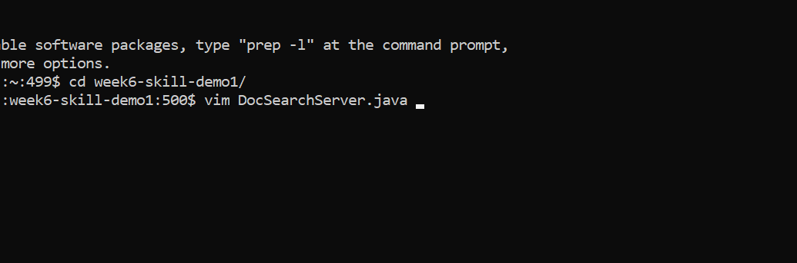
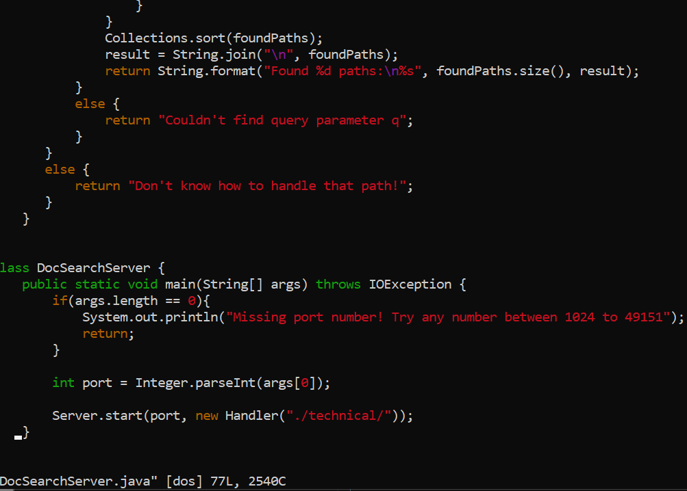
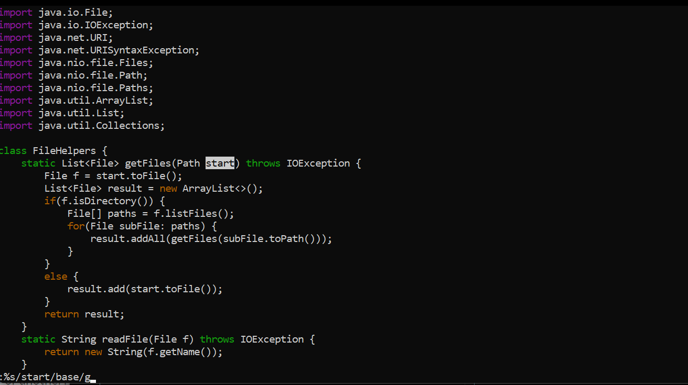
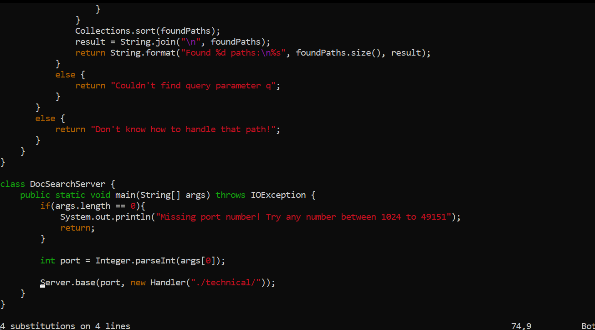
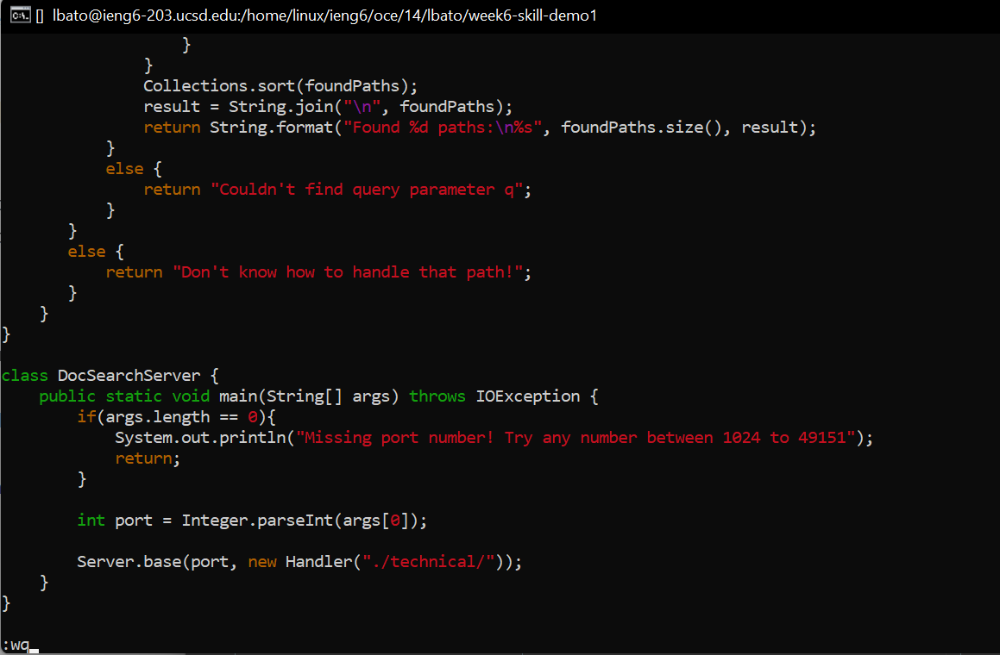
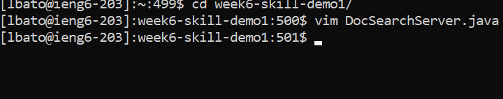

# Week 7 Lab Report #
## *By: Lorenzo Bato* ## 
# Part 1 #

**Task: `start` to `base`**

*We assume we are going to be starting in `week6-skill-demo1`*

Sequence (*Total: 28 keystrokes*):

* `vim D` + `<tab>` + `<enter>` (7 keystrokes)

*This command gets us into `vim` and uses `<tab>` keys to keep keystrokes down*

*  `:%s/start/base/g` + `<enter>` (17 keystrokes)

*This command replaces all instances of `start` to `base` using `:%s` to search the entire file and `/g` to replace all occurrences.*

* `:wq` + `<enter>` (4 keystrokes)

*This command saves all our edits in `DocSearchServer.java`*

# Part 2 #
**Comparing Methods**

*"VSC + `scp` vs. `ssh` + `vim`"*

**Method1 1: VSC + `scp`**

Time: 37.2 seconds

Notes: It can wildly vary, as I had to independently find each occurrence of `start` and manually replace it. I am unaware of any "replace all" features in VSC. It did not take long for it to upload, but I imagine that more expansive `scp`'s might take a lot longer depending on the project

**Method1 2: ssh + `vim`**

Time: 18.8 seconds

Notes: Starting already inside `docsearch` or `week6-skill-demo1`, all I had to do was remember the sequence above. The key presses were optimized already, so replacing was very easy with the `:%s/<old>/<new>/g` command (functions like "replace all"). Any typos, however, were a detriment.

**"Which of these two styles would you prefer using if you had to work on a program that you were running remotely, and why?"**

I am a lot more familiar with Method 1, but if I familiarize myself with `vim` more, I prefer editing files remotely via Method 2. It would save on upload speed and has some useful (yet situational and esoteric) commands.

**"What about the project or task might factor into your decision one way or another? (If nothing would affect your decision, say so and why!)"**

I think bringing time complexity is important, but I'd rather not think about it during editing, as I feel like "accurate" editing is much more efficient, much less prone to failure, and much more reliable than finding the most "optimized" way to edit. Comfortability is a big factor because I want accuracy in my coding before efficiency.