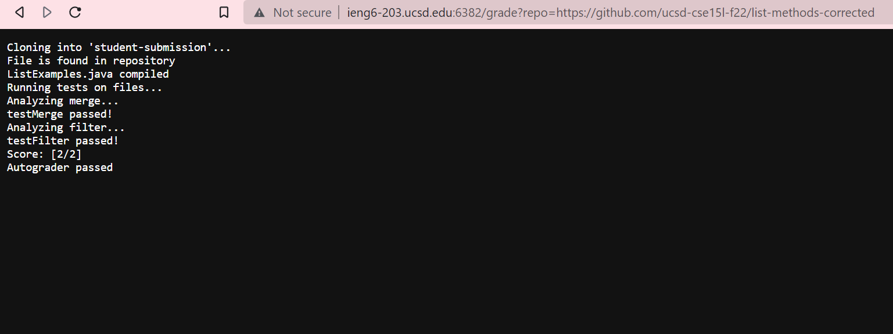
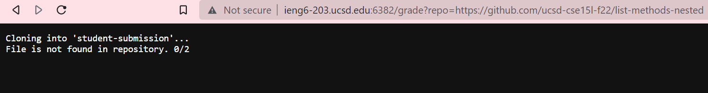
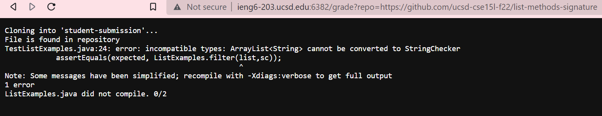

# Week 8 Lab Report #
## *By: Lorenzo Bato* ## 
# Code #
```
set -e

rm -rf student-submission
rm-f printout.txt
git clone $1 student-submission
score=0

CPATH=".:lib/hamcrest-core-1.3.jar:lib/junit-4.13.2.jar"

cp TestListExamples.java student-submission
cp -r lib student-submission
cp StringThing.java student-submission

cd student-submission
if [[ -e ListExamples.java ]]
then
    echo "File is found in repository"
else
    echo "File is not found in repository. 0/2"
    exit 1
fi

if javac -cp $CPATH *.java
then
    echo "ListExamples.java compiled"
else
    echo "ListExamples.java did not compile. 0/2"
    exit 1
fi

java -cp $CPATH orgjunit.runner.JUnitCore TestListExamples > printout.txt

echo "Analyzing merge..."
if [ $(grep -c "testMerge" printout.txt) -ne 0 ]
then
    echo "testMerge Failed!"
else
    let "score+=1"
    echo "testMerge passed!"
fi

echo "Analyzing filter..."
if [ $(grep -c "testFilter" printout.txt) -ne 0 ]
then
    echo "testFilter Failed!"
else
    let "score+=1"
    echo "testFilter passed!"
fi

if [ $score -eq 2 ]
then
    echo "Score: [2/2]"
    echo "Autograder passed"
fi
if [ $score -eq 1 ]
then
    echo "Score: [1/2]"
    echo "Check failed test methods above"
fi
if [ $score -eq 0 ]
then
    echo "Score [0/2]"
    echo "Check failed tests or compile"
fi
```



*repo: https://github.com/ucsd-cse15l-f22/list-methods-corrected*


*repo: https://github.com/ucsd-cse15l-f22/list-methods-nested*


*repo: https://github.com/ucsd-cse15l-f22/list-methods-signature*

# Trace #

Let's look at the first repository.
The first four lines prepare the script by removing added files and such. Their `stdout` is nothing and `stderr` is blank because it did not fail. Their exit code is 0 because they did not fail.
```
set -e

rm -rf student-submission
rm-f printout.txt
```

These next two lines will add the `score` and `CPATH` variable as well as copy over the student submission repository and other important files to help grading.Their `stdout` is nothing and `stderr` is blank because they did not fail. Their exit code is 0 because they did not fail. It also puts us currently within the student's repository.
```
git clone $1 student-submission
score=0

CPATH=".:lib/hamcrest-core-1.3.jar:lib/junit-4.13.2.jar"

cp TestListExamples.java student-submission
cp -r lib student-submission
cp StringThing.java student-submission

cd student-submission
```
This next `if` statement checks either or not `ListExamples.java` exists within the current directory `student-submission`. Its exit code is 0 because it found the file, which means it will echo the first `then` statement. The second statement will not run, meaning it won't exit early.
```
if [[ -e ListExamples.java ]]
then
    echo "File is found in repository"
else
    echo "File is not found in repository. 0/2"
    exit 1
fi
```

This `if` statement checks whether or not `javac -cp $CPATH *.java` will run and return the exit code of 0. It runs without any errors so there is no stdout or std error, and its exit code is 0. Since the command's exit code is 0, it will follow the first statement, echoing `ListExamples.java compiled`. It will skip over the second one because of the `if`-`else` statement.
```
if javac -cp $CPATH *.java
then
    echo "ListExamples.java compiled"
else
    echo "ListExamples.java did not compile. 0/2"
    exit 1
fi
```

This next command runs the `TestListExamples` file that uses JUnit to test the methods in `student-submission`. It will save the output in a new text file created and called `printout.txt`
```
java -cp $CPATH orgjunit.runner.JUnitCore TestListExamples > printout.txt
```

These next commands lets the user now which test it is checking for. We run the `echo` command to indicate that, and its stdout will be the message "Analyzing merge...". We check `printout.txt` if it returned an error relating to the `testMerge` test method, which tests the merge method of the student. Since it did not find anything, the `grep` command will exit 0, meaning the `else` statement is valid, which will also increment the score, indicating correctness. It will skip the `then` statement. 
```
echo "Analyzing merge..."
if [ $(grep -c "testMerge" printout.txt) -ne 0 ]
then
    echo "testMerge Failed!"
else
    let "score+=1"
    echo "testMerge passed!"
fi
```

Similarly, these next commands indicate we are checking for filter. We run the `echo` command to indicate that, and its stdout will be the message "Analyzing filter...". We check `printout.txt` if it returned an error relating to the `testFilter` test method, which tests the filter method of the student.Since it did not find anything, the `grep` command will exit 0, meaning the `else` statement is valid, which will also increment the score, indicating correctness. It will skip the `then` statement. 
```
echo "Analyzing filter..."
if [ $(grep -c "testFilter" printout.txt) -ne 0 ]
then
    echo "testFilter Failed!"
else
    let "score+=1"
    echo "testFilter passed!"
fi
```
These last `if` statements report on the score. It compares the `score` variable to a number to check the score of the submission. These `if` statements don't have an `else` statement, so those that do not match the `score` variable are skipped entirely. The `if [ $score -eq 2 ]` condition is valid, so it will `echo` the score and indicate that the Autograder has passed the submission.
```
if [ $score -eq 2 ]
then
    echo "Score: [2/2]"
    echo "Autograder passed"
fi
if [ $score -eq 1 ]
then
    echo "Score: [1/2]"
    echo "Check failed test methods above"
fi
if [ $score -eq 0 ]
then
    echo "Score [0/2]"
    echo "Check failed tests or compile"
fi
```
